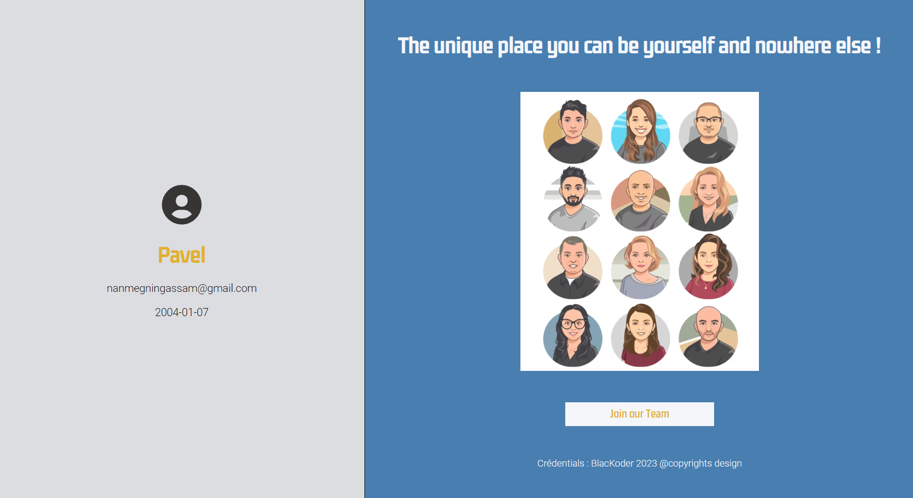
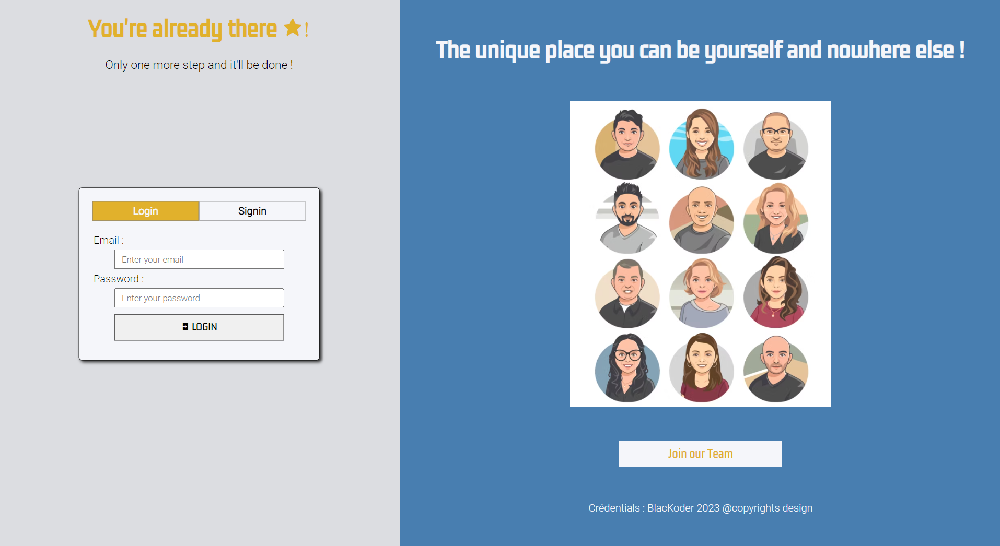

# Advanced_Form
Code an authentifcation system using JavaScript and some of his hooks (LocalStorage, sessionStorage, regex Expression, ...)

<!--Ajouter une photo de l'interface graphique ( mobile et web )-->

    
    

## Purposes
- Sharpen my skills in JavaScript ( and in TypeScript)
- Apply BEM (CSS) and SASS in a real project
- Get used to some project management realities
- make a little bit UI Design
- ...

Hope you'll enjoy it and don't hesitate to send me feedbacks!